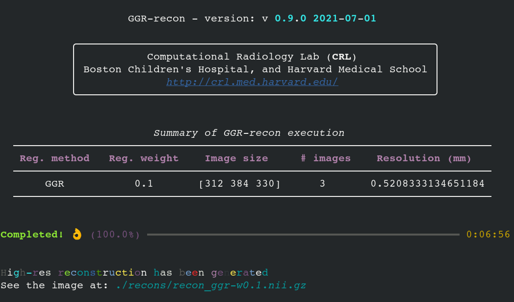

<div align="center"></div>

<div align="center"><a href="https://scholar.harvard.edu/files/suiyao/files/sui_miccai_2019.pdf">Paper 1</a> | <a href="https://scholar.harvard.edu/files/suiyao/files/sui_deepgg_miccai_2020.pdf">Paper 2</a></div>

# GGR-recon
A deconvolution-based MRI super-resolution reconstruction method with a gradient guidance regularization (GGR).

The reconstruction comprises two steps: 1) ***preprocessing*** and 2) ***deconvolution***, corresponding to the two python scripts, respectively, ***preprocess.py*** and ***recon.py***. In the preprocessing step, the algorithm deals with image alignment for motion compensation, computes automatically the geometric properties of the high-res reconstruction, creates the filters (for slice profiles and downsamplings) used in the deconvolution step, and offers a gradient guidance reference for the regularization of the deconvolution. The preporcessing also provides a resampling mode, which is usually used to determine the geometric properties of the high-res reconstruction manually. In the deconvolution step, the regularization is created and then the regularized deconvolution is performed in the Fourier domain.

## Dependencies
### Docker mode
- **Docker**: https://www.docker.com/

### Python mode
- **NumPy**: https://numpy.org/
- **Scipy**: https://www.scipy.org/
- **SimpleITK**: https://simpleitk.org/
- **Rich**: https://rich.readthedocs.io/en/stable/introduction.html
- **CRKIT**: http://crl.med.harvard.edu/software/

## Getting started
GGR-recon can be run in either ***docker*** or ***python*** mode. We *strongly* recommend using GGR-recon in the ***docker*** mode, as the issues about the environment configuration and version conflicts can be maximally mitigated.

### Docker mode
If you are using a proxy in your network, you need to configure your docker enviroment with the proxy. The configuration is presented in the Appendix section below. If not, you could directly build the docker image and use it with docker.

#### Build docker image
```console
cd /path/to/your/code/folder
docker build -t your-ggr-tag .
```
In general, the tag is set in the form of foo/bar:x.x.x_\*.\*.\*, where x.x.x denotes the docker image version and \*.\*.\* denotes the software version, e.g., crl/ggr:0.0.1_0.9.0

### Python mode
#### Configure python environment
Run the following command to install the python libraries
```console
python -m pip install -r ./requirements.txt
```
Install the CRKIT software suit and configure it in your *~/.bahsrc*
```console
wget http://crl.med.harvard.edu/CRKIT/CRKIT-1.6.0-RHEL6.tar.gz
tar -xf CRKIT-1.6.0-RHEL6.tar.gz

export BUNDLE=/path/to/crkit/crkit-1.6.0
export PATH=$PATH:$BUNDLE/bin
export LD_LIBRARY_PATH=$LD_LIBRARY_PATH:$BUNDLE/Frameworks/InsightToolkit:$BUNDLE/Frameworks/vtk-6.1:$BUNDLE/Frameworks/qt-5.3.2/lib:$BUNDLE/lib:$BUNDLE/bin
export QT_PLUGIN_PATH=$BUNDLE/Frameworks/qt-5.3.2/plugins
export DYLD_LIBRARY_PATH=""
```

## Usage
### View help
#### Docker mode
```console
docker run -it --rm --name ggr your-ggr-tag preprocess.py -h
```

```
usage: preprocess.py [-h] [-V] [-f FORMAT [FORMAT ...]] [-s SIZE [SIZE ...]]
                     [-r]

optional arguments:
  -h, --help            show this help message and exit
  -V, --version         show version
  -f FORMAT [FORMAT ...], --format FORMAT [FORMAT ...]
                        formats of the low-res images, by default is .nii.gz;
                        no repeated elements included; e.g., -f .nhdr .nrrd
                        .nii .nii.gz
  -s SIZE [SIZE ...], --size SIZE [SIZE ...]
                        size of the high-res reconstruction, optional; 3
                        positive integers (sagittal coronal axial) required if
                        set; e.g., -s 312 384 330
  -r, --resample        resample the first low-res image in the high-res
                        lattice and then exit. Usually used for determining a
                        user defined size of the high-res reconstruction
```
#### Docker mode
```console
docker run -it --rm --name ggr your-ggr-tag recon.py -h
```


```
usage: recon.py [-h] [-V] [--ggr | --tik] [-w REG_WEIGHT]

optional arguments:
  -h, --help            show this help message and exit
  -V, --version         show version
  --ggr                 use GGR regularization, default
  --tik                 use Tikhonov regularization
  -w REG_WEIGHT, --reg-weight REG_WEIGHT
                        weight of the regularization, by default is 0.1
```

### Input and output
GGR-recon requires the input low-res images to be put at the folder of name *data* in the root of the code tree. GGR-recon detects all available low-res images and uses them to reconstruct the high-res image. In the docker mode, the *data* folder can be anywhere and needs to be mounted in the container by the *-v* argument when running the docker container. Note that absolute paths are required in the mounting.
```console
-v /your/data/folder:/opt/GGR-recon/data
```
The intermediate and final results are placed in the folders of *working* and *recons*, respectively, which are created by GGR-recon itself. In the docker mode, these folders are required to be mounted as well to receive the results, similar to the input folder.

For instance, running the **preprocessing** step with the default setting in the docker mode can be accomplished by
```console
docker run -it --rm --name ggr-recon \
  -v /your/data/folder:/opt/GGR-recon/data \
  -v /your/working/folder:/opt/GGR-recon/working \
  -v /your/recons/folder:/opt/GGR-recon/recons \
  your-ggr-tag preprocess.py
```

Another example is to run in the docker mode the **deconvolution** step with the GGR regularization that is weighted by 0.03
```console
docker run -it --rm --name ggr-recon \
  -v /your/data/folder:/opt/GGR-recon/data \
  -v /your/working/folder:/opt/GGR-recon/working \
  -v /your/recons/folder:/opt/GGR-recon/recons \
  your-ggr-tag recon.py --ggr -w 0.03
```

### Baseline implementation
In the **deconvolution** step, a total variation (TV) regularization is also implemented with the Tikhonov criterion, for the comparison to our gradient guidance regularization (GGR). To enable the TV regularization instead of GGR, use the option *--tik* when running *recon.py*

## Appendix
### Data acquisition protocol
We recommend acquiring three low-res images in the three complementary planes respectively. Each low-res image comprises high in-plane resolution and thick slices. For example, we acquire T2 TSE images with an in-plane resolution of 0.5mm x 0.5mm and thickness of 2mm, and reconstruct the high-res image at the isotropic resolution of 0.5mm. It takes two minutes to acquire such an image on our scanner. With this protocol, GGR-recon never enhances in-plane resoltuion but reduces slice thickness.

### Configure docker environment
The configuration for docker is mainly about the proxy setting. The proxy needs to be set by two steps: 1) declare in the Dockerfile and 2) set in the system level.

In the *Dockerfile*, add the environment variables by
```Docker
ENV http_proxy "http://your.proxy.edu:3128"
ENV no_proxy "127.0.0.1,localhost"
```
For the system level configuration, edit the file */etc/systemd/system/docker.service.d/http-proxy.conf* and insert the following lines
```
[Service]
Environment="HTTP_PROXY=http://your.proxy.edu:3128"
Environment="NO_PROXY=localhost,127.0.0.1"
```
Flush changes and restart Docker
```console
 sudo systemctl daemon-reload
 sudo systemctl restart docker
```
Verify that the configuration has been loaded and matches the changes you made, for example:
```console
sudo systemctl show --property=Environment docker
```
```
Environment=HTTP_PROXY=http://your.proxy.edu:3128 NO_PROXY=localhost,127.0.0.1
```

The proxy setting can also be set in the file *~/.docker/config.json* with the following lines
```js
{
  "proxies":
  {
    "default":
    {
      "httpProxy": "http://your.proxy.edu:3128",
      "noProxy": "127.0.0.1,localhost"
    }
  }
}
```

Then, build your docker image with the proxy arguemnt by
```
docker build --build-arg http_proxy=http://your.proxy.edu:3128 -t your-ggr-tag .
```

or build your docker image with the build computer network:
```
docker build --network=host  -t crl/ggr-recon .
```


Build command without proxy:
```
docker build  -t crl/ggr-recon .
```


## References
  1. Yao Sui, Onur Afacan, Ali Gholipour, and Simon K. Warfield. 2019. “**Isotropic MRI Super-Resolution Reconstruction with Multi-Scale Gradient Field Prior**.” *International Conference on Medical Image Computing and Computer Assisted Intervention (MICCAI)*. Shen Zhen, China. <a href="https://scholar.harvard.edu/files/suiyao/files/sui_miccai_2019.pdf">PDF</a>
  2. Yao Sui, Onur Afacan, Ali Gholipour, and Simon K. Warfield. 2020. “**Learning a Gradient Guidance for Spatially Isotropic MRI Super-Resolution Reconstruction**.” *International Conference on Medical Image Computing and Computer Assisted Intervention (MICCAI)*. Lima, Peru. <a href="https://scholar.harvard.edu/files/suiyao/files/sui_deepgg_miccai_2020.pdf">PDF</a>


## Applications
1. "**Super-resolution reconstruction of T2-weighted thick-slice neonatal brain MRI scans.**" Incebak et al. 2002. PMID: 34506677 PMCID: PMC8752487 DOI: 10.1111/jon.12929  https://pubmed.ncbi.nlm.nih.gov/34506677/

   This paper examined the use of this type of super-resolution for imaging of neonates. Qualitative and quantitative assessments showed that 3D SRR of several LR images produces images that are of comparable quality to standard 2D HR image acquisition for healthy neonatal imaging without loss of anatomical details with similar edge definition allowing the detection of fine anatomical structures and permitting comparable morphometric measurement.
